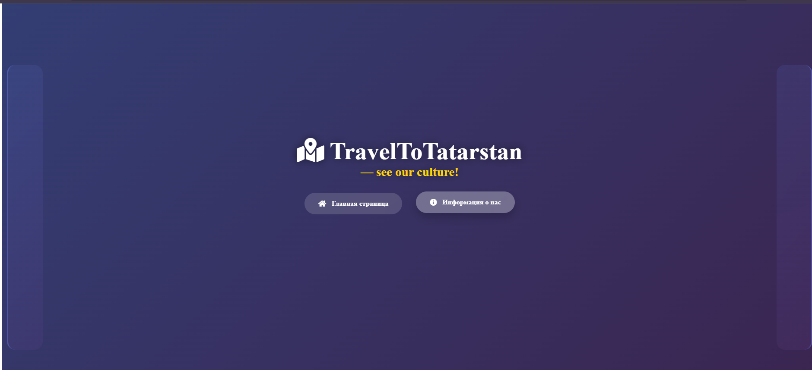
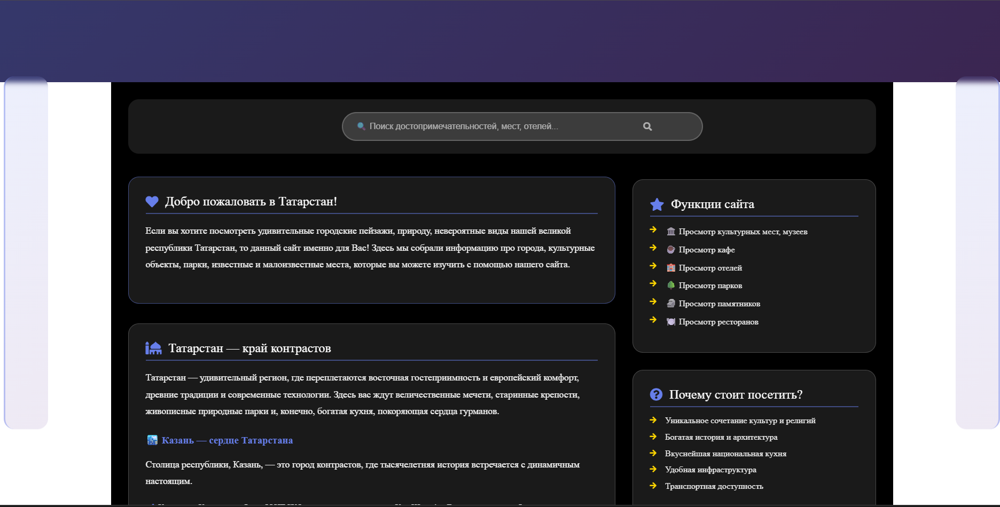
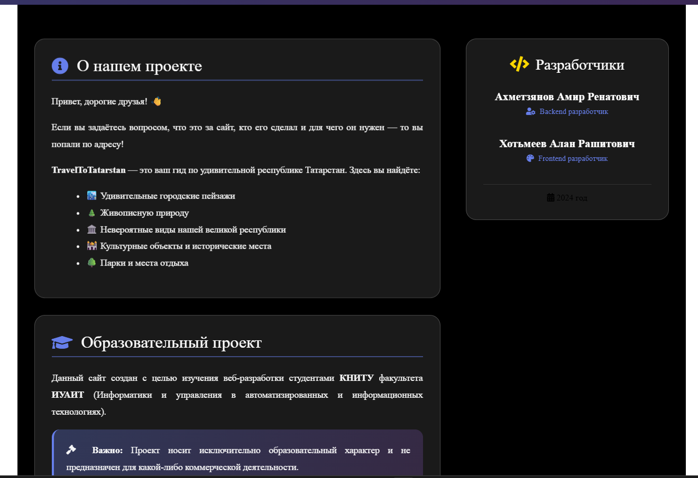

# GEO_API

# Description
The website is using API from 2GIS and sending picture of map to user.

# How to begin using website
To begin using the website you need to create `.env` file in the main root and fill the lines API_KEY and SERVER_POR as in `.env.example`. To get free API from 2GIS you need to authorize here https://platform.2gis.ru/ru/keys and you can get free API for a month.

# Screenshots

Header

Main page

About page

